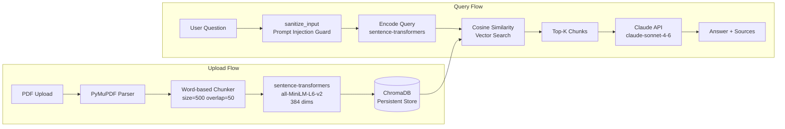
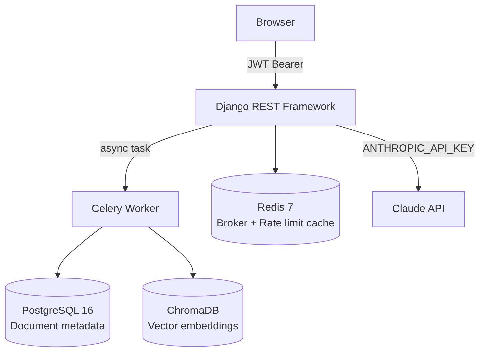

# RAG Chatbot

[](https://github.com/pabloncf/rag-chatbot/actions/workflows/ci.yml)
[](https://www.python.org/downloads/release/python-3120/)
[](https://www.djangoproject.com/)
[](https://github.com/pabloncf/rag-chatbot)
[](LICENSE)

A production-grade **Retrieval-Augmented Generation (RAG)** chatbot built with Django. Upload PDF documents, ask questions in natural language, and receive answers grounded in your document content — powered by the Claude API.

---

## Architecture





---

## Tech Stack

| Layer | Technology | Why |
|---|---|---|
| Backend | Django 5 + DRF | Battle-tested, clean ORM, great ecosystem |
| Auth | JWT (SimpleJWT) | Stateless, API-friendly |
| Vector store | ChromaDB | Zero-config for demos; swappable via abstraction layer |
| Embeddings | sentence-transformers `all-MiniLM-L6-v2` | Local inference — zero API cost, 384-dim, fast |
| LLM | Claude API (`claude-sonnet-4-6`) | Differentiates from GPT-based tutorials |
| PDF parsing | PyMuPDF (`fitz`) | Fastest Python PDF library |
| Task queue | Celery + Redis | Non-blocking PDF processing, prevents request timeouts |
| Database | PostgreSQL 16 | Production-grade relational store for metadata |
| Static files | WhiteNoise | Serves static assets from Gunicorn without Nginx |
| Containerization | Docker + Docker Compose | Single-command local setup |

---

## Quick Start

```bash
# 1. Clone and configure
git clone https://github.com/pabloncf/rag-chatbot.git
cd rag-chatbot
cp .env.example .env
# Edit .env — set ANTHROPIC_API_KEY and a strong SECRET_KEY

# 2. Start all services (web, worker, db, redis)
docker compose up --build

# 3. Open the app
open http://localhost:8000
```

The app will be available at `http://localhost:8000`. Register an account, upload a PDF, and start chatting.

---

## API Reference

All responses follow the envelope format:
```json
{ "status": "success|error", "data": {}, "message": "" }
```

### Auth

| Method | Endpoint | Description |
|---|---|---|
| `POST` | `/api/auth/register/` | Register (email + password) |
| `POST` | `/api/auth/login/` | Login → access + refresh tokens |
| `POST` | `/api/auth/refresh/` | Refresh access token |
| `GET` | `/api/auth/me/` | Current user info |

### Documents

| Method | Endpoint | Description |
|---|---|---|
| `POST` | `/api/documents/upload/` | Upload a PDF (multipart) |
| `GET` | `/api/documents/` | List user's documents |
| `GET` | `/api/documents/{id}/` | Document detail + status |

### Chat

| Method | Endpoint | Description |
|---|---|---|
| `POST` | `/api/chat/` | Ask a question (RAG pipeline) |
| `GET` | `/api/chat/conversations/` | List conversations |
| `GET` | `/api/chat/conversations/{id}/messages/` | Message history |

### System

| Method | Endpoint | Description |
|---|---|---|
| `GET` | `/api/health/` | Health check |
| `GET` | `/api/metrics/` | Per-user resource counts (auth required) |

**Rate limits:** Chat: 10 req/min per user · Upload: 5 req/min per user · Login: 10 req/min per IP · Register: 5 req/min per IP

---

## Project Structure

```
rag-chatbot/
├── apps/
│   ├── chat/            # Conversations, RAG pipeline, Claude integration
│   │   └── services/
│   │       ├── llm_service.py    # Claude API + prompt-injection sanitizer
│   │       └── retriever.py      # Vector search + ownership validation
│   ├── documents/       # Upload, PDF parsing, async chunking
│   │   └── services/
│   │       ├── pdf_parser.py     # PyMuPDF text extraction
│   │       └── chunker.py        # Word-based chunker (size=500, overlap=50)
│   ├── embeddings/      # sentence-transformers + ChromaDB
│   │   └── services/
│   │       ├── embedding_service.py  # Singleton model loader
│   │       └── vector_store.py       # ChromaDB CRUD (swappable abstraction)
│   └── users/           # Custom user model (email-based), JWT views
├── config/
│   ├── middleware.py    # SecurityHeadersMiddleware (CSP, Referrer-Policy…)
│   ├── metrics.py       # /api/metrics/ view
│   └── settings/
│       ├── base.py      # Shared settings
│       ├── development.py
│       └── production.py
├── static/
│   ├── css/app.css      # Dark theme, CSS Grid layout
│   └── js/app.js        # Vanilla JS: auth, upload, chat, polling
├── templates/
│   ├── login.html
│   └── chat/index.html
├── docker-compose.yml
├── Dockerfile           # Multi-stage; pre-downloads sentence-transformers model
└── entrypoint.sh        # migrate + collectstatic on container start
```

---

## Security Features

- **Content-Security-Policy** — no inline scripts, `object-src 'none'`
- **CORS** — API-only (`/api/*`), origins configurable per environment
- **JWT** — short-lived access tokens (60 min), 7-day refresh tokens
- **Prompt injection guard** — strips 9 known injection patterns before sending to Claude
- **File upload validation** — extension, MIME type, magic bytes (`%PDF`), configurable size limit
- **Rate limiting** — per-user on chat and upload; per-IP on auth endpoints
- **Structured JSON logging** — production-ready for Datadog / CloudWatch ingestion

---

## Running Tests

```bash
# Run full suite
docker compose exec web pytest

# With coverage report
docker compose exec web pytest --cov=apps --cov=config --cov-report=term-missing

# Single app
docker compose exec web pytest apps/chat/
```

Current coverage: **96%** (target: 80%+)

---

## Environment Variables

| Variable | Required | Description |
|---|---|---|
| `SECRET_KEY` | ✅ | Django secret key |
| `ANTHROPIC_API_KEY` | ✅ | Claude API key |
| `DATABASE_URL` | ✅ | PostgreSQL connection string |
| `REDIS_URL` | ✅ | Redis connection string |
| `DEBUG` | — | `True` for development |
| `ALLOWED_HOSTS` | — | Comma-separated hostnames |
| `CHROMA_PERSIST_DIRECTORY` | — | Path for ChromaDB data (default: `/app/chroma_data`) |
| `MAX_UPLOAD_SIZE` | — | Max PDF size in bytes (default: 10 MB) |
| `CORS_ALLOWED_ORIGINS` | — | Comma-separated origins (production only) |

See `.env.example` for a complete template.

---

## Key Design Decisions

**ChromaDB over pgvector** — Simpler setup for portfolio demos; no PostgreSQL extension required. The `vector_store.py` abstraction layer makes swapping trivial.

**Local embeddings over API** — `sentence-transformers` runs in-process with zero API cost. The model is pre-downloaded into the Docker image at build time, so there's no cold-start delay.

**Celery for PDF processing** — Large PDFs can take seconds to parse and embed. Async processing via Celery prevents HTTP timeouts and gives users immediate feedback (`status: pending → processing → ready`).

**Claude API over OpenAI** — Differentiates from the majority of RAG tutorials while targeting current enterprise demand for Anthropic's models.

---

## License

MIT
